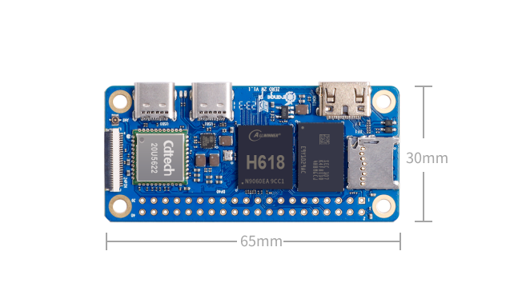

# AgentOS

    

<h1 align="center">AgentOS: Empowering Your AI Assistant</h1>

AgentOS opens the door to a new era of AI technology. It's your personal AI companion, always ready to assist you with natural language commands. Say goodbye to juggling multiple apps – AgentOS streamlines tasks by letting AI handle them for you, freeing you from the confines of your smartphone.

Price: ~~$199~~ -> $19.9

Regarding rabbit r1, someone commented:
>In reality, they're simply relying on several Playwright automation scripts to do the job for you, which is why they only support four apps: Spotify, Midjourney, Doordash, and UberEats.
What's even more alarming is that they ask you to login through their web portal, which is just a virtual machine connected via NoVNC.  They also expect you to fill in your private passwords on their VMs.  To make matters worse, they store the user sessions on their machines without any additional layers of security.  This is both a blatant disregard for user privacy and a hilariously bad engineering practice.

Simply integrating APKs doesn't fully harness the power of the Android OS. 
Modifying the Android OS deeply to link various components through an Agent might be a better approach.

Here, we adopt the development approach of [fwkdev](https://github.com/10cl/fwkdev), controlling the behavior of applications through [promptflowx](https://github.com/10cl/promptflowx), with website and app control serving as tools. 
For website control, we use the [chatdev](https://github.com/10cl/chatdev) browser plugin, integrating the chatdev plugin into a customized browser to control web pages, and then controlling applications through hooks. This way, applications and web pages serve as tools for the Agent.
